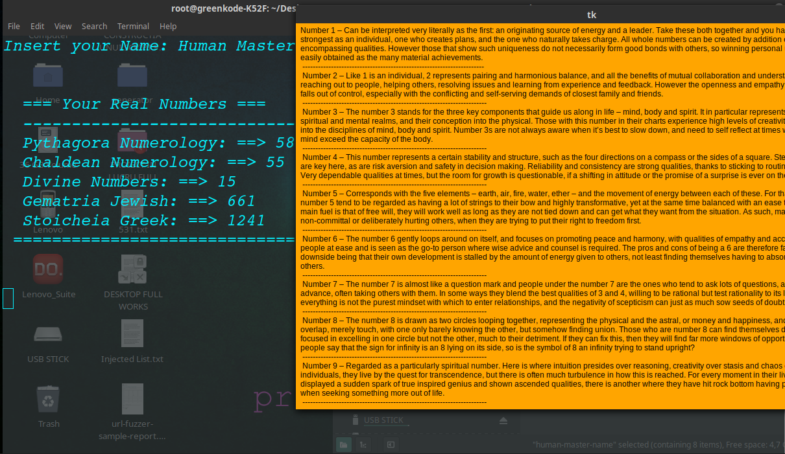

HUMAN NUMBER NAME -is professional numerology calculator

How is Work
---------------------

Terminal execution

Install "dependencies"
=========================

virtualenv -p python3 myenv
source myenv/bin/activate

pip3 install -r requirements.txt

or,

sudo apt-get install python3-tk

Open Terminal, run this line:

   python3  ./master-name.py  'your-name'               
   

   Insert "Your Name or Full Name"

   (like: python3 ./master-name.py 'your-name-here' )

Press --> Enter
Check your Results!!

or

  python3  ./master-insert-name.py

Press --> Enter
and

Check your Results!!

======================================================================

License & Copyright
--------------------

Licensed under the [MIT License](LICENSE)

Donation Project
================

Project Name: Human.Number.Name

Bitcoin:              3AFWVZFfGUDJ91PzJGR2SNKarbkpjZTYM1

Bitcoin Cash:         bitcoincash:qrwq9pa37jwz799ev6vctyfk2ka43fmkqvqjrg0kr2

